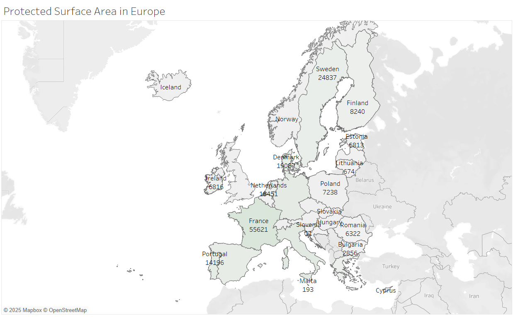
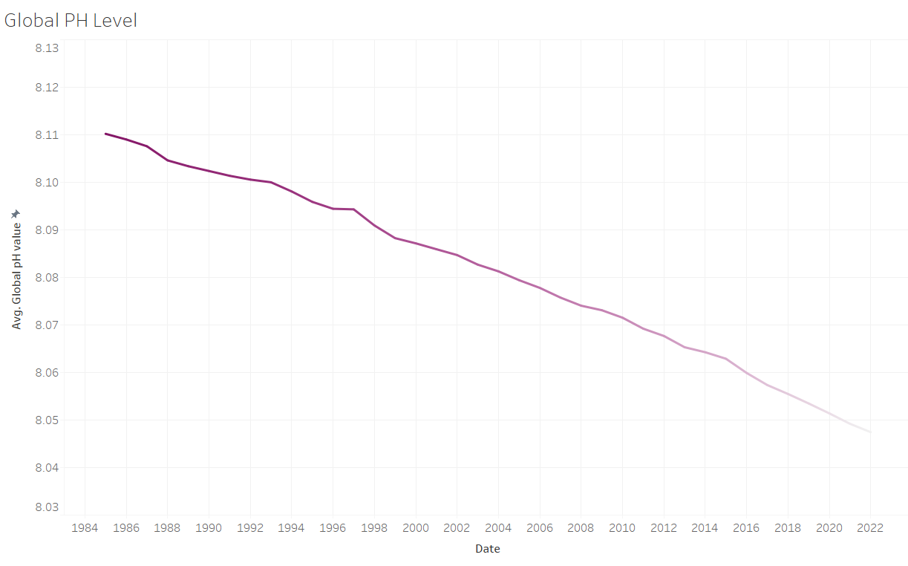
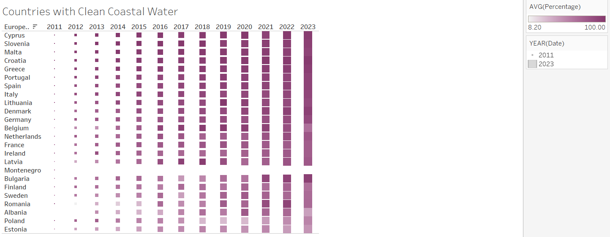
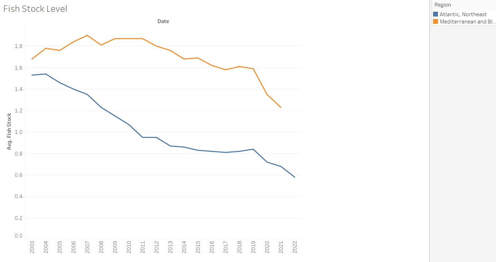
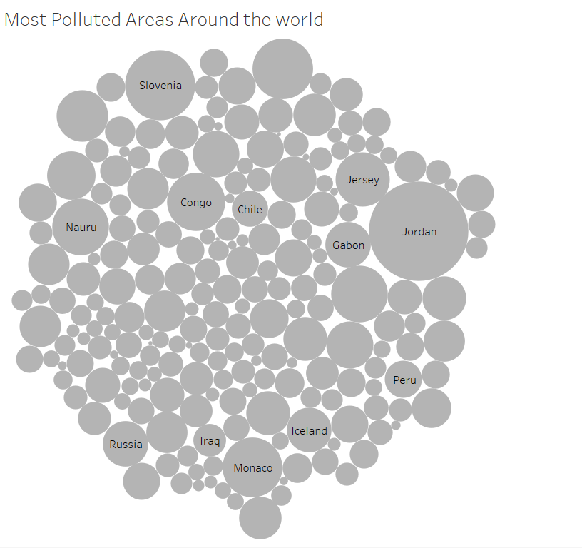
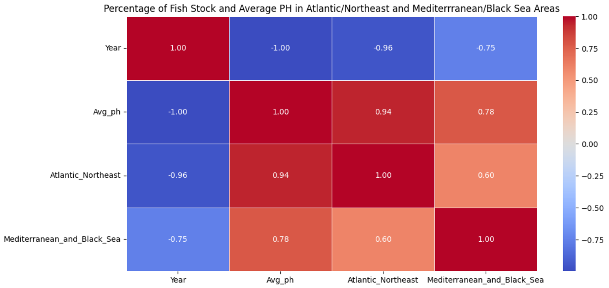
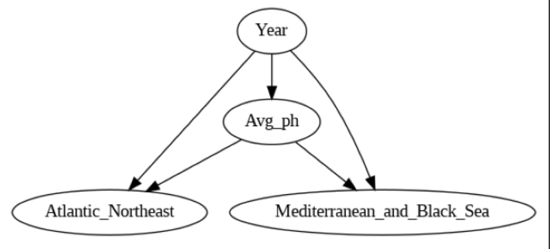

# Protection of Oceans, Seas, and Marine Resources for Sustainable Development

*By: Vinay Prajapati*
## Executive Summary
Goal 14 of the UN Sustainable Development Goals aims to protect oceans, seas, and marine resources. Oceans cover 70% of Earth, regulating climate, providing food, and supporting jobs. However, pollution, overfishing, habitat loss, and climate change threaten these ecosystems, which many vulnerable communities depend on. Protecting them is crucial for both ecological and economic stability.

[Read detailed background](Background.md)

## Key Performance Indicators

1. Marine Protected Area Coverage Rate
- This KPI identifies the protected areas based on the region which help to know the most and least protected regions in Europe.
- Target: To prevent and significantly reduce marine pollution in particular land-based activities by 2025.
- Frequnecy: Annually 

2. Ocean Acidity Reduction
- Addressing ocean acidity is important as the more marine waters become acidic it will harm aquatic life and lead to destroying of life under water.
- The decline in the pH level  means the marine water is getting more acidic and the invrease in the pH level would mean less acid in the water.
- Target: By 2030, reduce and mitigate the effects of ocean acidification, especially by strengthening collaboration among scientists at all levels.
- Frequency: Annually

3. Water Quality
- Addressing this KPI is crucial to know the quality of water and how clean it is and wheather it is harming the auqatic life or not underwater.
- This helps us classify the inland and marine bathing waters as poor, good or excellent.
-Range: 1%-100%
- Frequency: Annual

4. Sustainable levels of Fish Stock
-  This KPI helps informs us of the amount of fish stock and species avaialble for sustainable fishing w=as overfishing will lead to extinction of some species.
-  Target: To regukate the level of fishing and end illegal, overfishing and unregulated fishing and poor fishing practices by 2030.
-  Frequnecy: Annual

6. Marine Pollution Reduction
- Addressing marine pollution supports the sustainability of fisheries by protecting fish stocks and aquatic habitats, ensuring that fishing communities can thrive
economically while maintaining ecological integrity.
- The Index of coastal eutrophication; and plastic waste cleaned from oceans.
- Target: By 2025, prevent and drastically reduce marine pollution of all kinds, especially from land-based activities, such as nutrient pollution and marine 
  debris.
- Range: 1%-100%
- Frequency: Annual

# Analysis

## Countries with the most Protected Surface Area

The above image illustrates that France has the most protected surface areas in Europe compared to other countries.

## Global PH Level

The above line grapgh shows that the PH level has been steadily declining from 1985 to 2022. This means the acidity level of the water has been increasing slowly in the European Regions.

## Countries with Clean Coastal Water

According to the data analyzed as illustrated above it shows Cyprus as the country with the most clean water from 2011 to 2023 with an average higher than other countries through out this period.

## Fish Stock with Sustainable levels

The line grapgh above shows Fish stock on a rapid decline form 2003 to 2022 from the Atlantic, NorthEast and Mediterranean and Black Sea.
 
## Countries With Most Marine Pollution

The region with the most marine pollution is Jordan which is indicated by the larger circle according to the world data from 2005 to 2022.

# Causal Inference & Correlation Analysis 

As ocean acidity increases over time, fish stocks in both the Atlantic Northeast and Mediterranean/Black Sea decline. The fish populations in these regions are connected, likely due to shared environmental factors or migration.

## Percentage of Fish Stock and Average PH in Atlantic/Northeast and Mediterrranean/Black Sea Areas

The heatmap shows that ocean acidity has increased over time, leading to a decline in fish stocks in the Atlantic Northeast and Mediterranean/Black Sea regions. A strong negative correlation between Year and pH (-1.00) means the ocean is becoming more acidic. Fish stocks are positively correlated with pH (0.94 to 0.78), meaning less acidic water supports more fish. The negative correlation between Year and Fish Stock (-0.96 to -0.75) suggests fish populations are shrinking over time. Lastly, the moderate correlation (0.60) between both regions shows that fish stock changes in one area also affect the other, possibly due to migration or shared environmental conditions.

## Causal Graph

This image shows how different factors might influence fish stock in two regions. Year affects both Avg_ph (average pH levels) and fish stock in the Atlantic Northeast and Mediterranean/Black Sea. Avg_ph also directly influences fish stock in both regions. This suggests that changes over time (like climate change) impact water pH, which in turn affects fish populations in both areas.

## Refute Analysis 

The analysis suggests that average pH levels negatively impact fish stock in the Atlantic Northeast, but there are possible issues that could make this result unreliable. Factors like pollution, temperature, and fishing regulations might also influence fish stock, but they aren’t included in the model. There’s also a chance that fish stock changes could affect pH levels, meaning the cause-and-effect relationship might not be straightforward. If the data is limited to certain years or regions, the findings might not apply everywhere. Since the estimated effect (-91.93) is quite strong, further checks, like testing for hidden factors or using different methods, are needed to confirm if this result is truly accurate.

## Conclusion

In conclusion, while the analysis suggests a strong negative effect of pH on fish stock in the Atlantic Northeast, potential biases like unmeasured factors, reverse causality, and data limitations could affect the reliability of the estimate. To confirm these findings, further validation through sensitivity tests and consideration of additional influencing factors is necessary.

